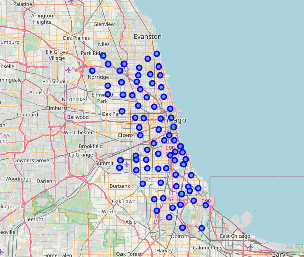
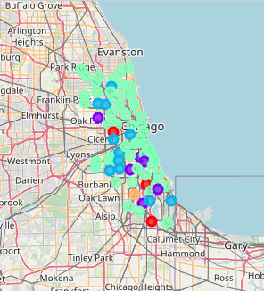
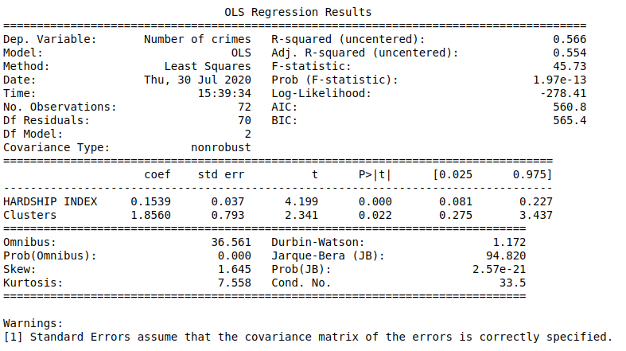

<h1>Coursera_Capstone</h1>

This repository will be mainly used for the capstone project. This assignment will be graded by other peers who are taking the course during the same session.

<h3>Introduction</h3>

This report is for the final course of the Data Science Specialization. A 9-courses series created by IBM, hosted on Coursera platform. The problem and the analysis approach are left for the learner to decide, with a requirement of leveraging the Foursquare location data to explore or compare neighborhoods or cities of your choice or to come up with a problem that you can use the Foursquare location data to solve.
The main goal will be exploring the neighborhoods of Chicago city in order to extract the correlation between the Number of Crimes and its surrounding venues and Economic Index (Hardship Index of Community Areas)

The idea comes from the process of understanding why there are some community areas with more crimes than others, and two good features for that are Economic factors (such as unemployment, education and income) and geographic feature represented by surrounding venues. Surrounding places have peculiar characteristics such as shops, parks and sights that may be associated with the number of crimes.

The target audience for this report are:

<ul>
    <li>Public Policy Makers.</li>
    <li>Researchers with interest in Econometrics and Sociology.</li>
    <li>Residents looking to understand the amount of crime in their city</li>
    <li>And of course, to this course’s instructors and learners who will grade this project. Or to anyone who catch this shared on the social media showing that I can use Python data science tools.</li>
</ul>

<h3>Data Description</h3>

The main goal is taking the last 1000 crimes from Chicago and mapping all those crimes in community areas. Then, after finding latitude and longitude of community areas, insert some surrounding venues from Foursquare. With that data we want to understand how the characteristics and points of community areas influence in criminality levels.

The Source of Data:

Crime Data:

This dataset reflects reported incidents of crime (with the exception of murders where data exists for each victim) that occurred in the City of Chicago from 2001 to present, minus the most recent seven days. Data is extracted from the Chicago Police Department's CLEAR (Citizen Law Enforcement Analysis and Reporting) system. In order to protect the privacy of crime victims, addresses are shown at the block level only and specific locations are not identified.

Link:

<a href="https://data.cityofchicago.org/Public-Safety/Crimes-2001-to-Present/ijzp-q8t2">https://data.cityofchicago.org/Public-Safety/Crimes-2001-to-Present/ijzp-q8t2</a>

Census Data:

This dataset contains a selection of six socioeconomic indicators of public health significance and a “hardship index,” by Chicago community area, for the years 2008 – 2012. The indicators are the percent of occupied housing units with more than one person per room (i.e., crowded housing); the percent of households living below the federal poverty level; the percent of persons in the labor force over the age of 16 years that are unemployed; the percent of persons over the age of 25 years without a high school diploma; the percent of the population under 18 or over 64 years of age (i.e., dependency); and per capita income. Indicators for Chicago as a whole are provided in the final row of the table.

Link:

<a href="https://data.cityofchicago.org/Health-Human-Services/Census-Data-Selected-socioeconomic-indicators-in-C/kn9c-c2s2">https://data.cityofchicago.org/Health-Human-Services/Census-Data-Selected-socioeconomic-indicators-in-C/kn9c-c2s2</a>

Coordinates:

Current community area boundaries in Chicago. The data can be viewed on the Chicago Data Portal with a web browser. However, to view or use the files outside of a web browser, you will need to use compression software and special GIS software, such as ESRI ArcGIS (shapefile) or Google Earth (KML or KMZ), is required. But you can also have some data about these boundaries in github repositories which give us in a easier way Latitudes and Longitudes.

Link:

<a href="https://data.cityofchicago.org/Facilities-Geographic-Boundaries/Boundaries-Community-Areas-current-/cauq-8yn6">https://data.cityofchicago.org/Facilities-Geographic-Boundaries/Boundaries-Community-Areas-current-/cauq-8yn6</a>

<h3>Results</h3>

 

 

 
